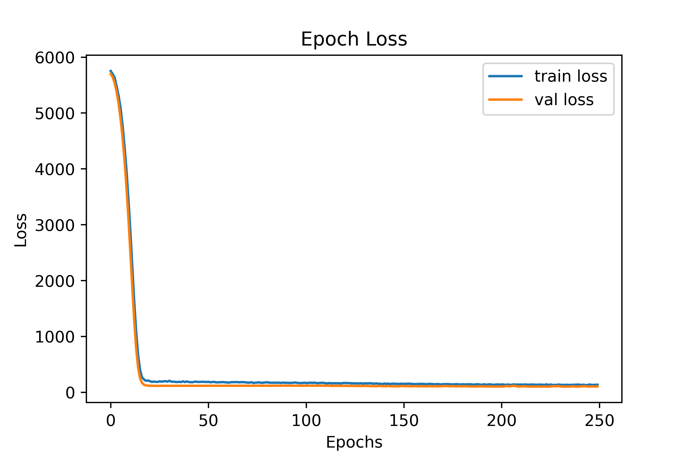
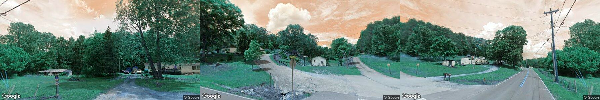
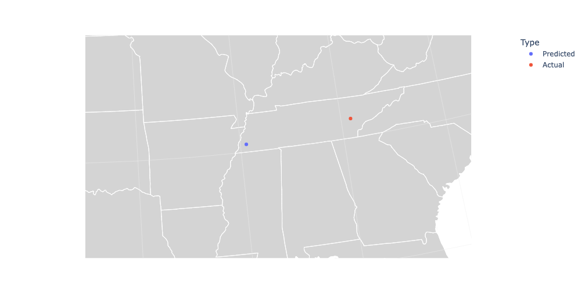
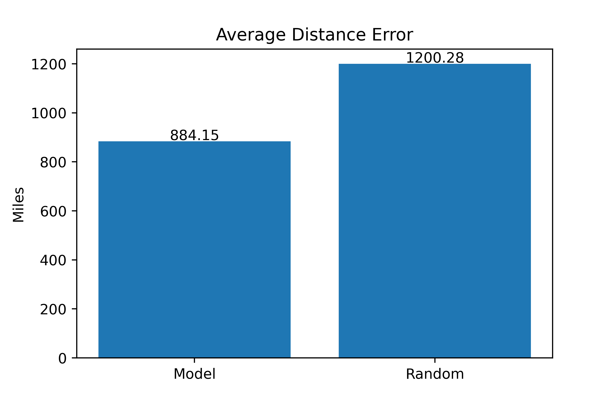
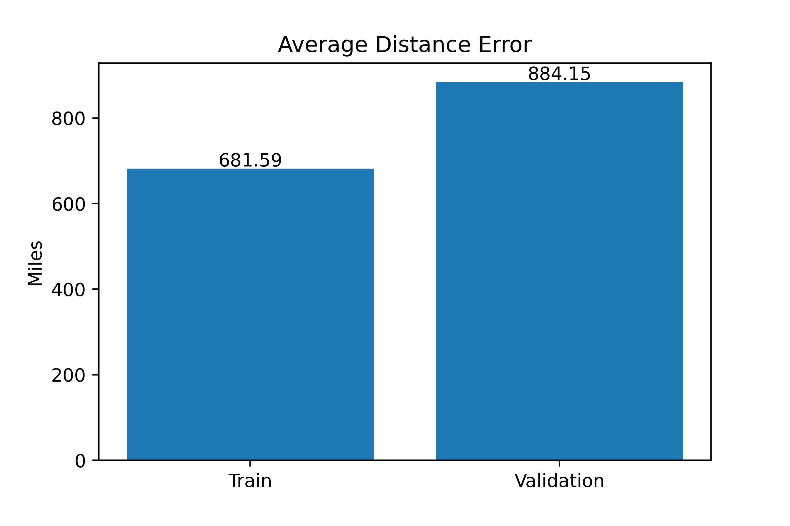

# Project_Berberette_Price

# References
[1] https://nirvan66.github.io/geoguessr.html
We took inspiration from this previous project and attempted to improve the results and collect more data. Our main contributions to the training portion of the project were:
- include creating a custom training loop and a custom loss function.
- Parallelizing the model itself with tensorflow distributed.
- Changing the model to use regression rather than classification to make the model more scalable with larger amounts of data.
- Hyperparameter tuning the model params such as the dropout rates
- Adding a learning rate scheduler to the training loop.

In the previous work the model was trained to predict a particular grid that a particular set of images was located at. They used categorical crossentropy loss to accomplish this. However, this approach is not scalable for large amounts of global data. This is because the more locations that you train the model on the more grids that the model will be able to predict. This will lead to a one hot encoded y vector of an immensely large size. Additionally, this does not punish the model for predicting a certain grid that is nowhere near the actual location of the image. We approached this problem by using regression rather than classification. Our results are comparable to the previous project, but there is more work to be done and model improvements for our approach to be viable. This leads us to our future work.
## Running The Code
We have created a requirements.txt file that holds all the packages used throughout the project. First, pull the main branch of the GitHub repository using the command `git clone https://github.com/CISC879-BigData/Project_Berberette_Price.git`. One can then replicate the conda environment by executing the command `$ conda create --name <env> --file requirements.txt` within the cloned project's directory. 

After properly cloning and installing the necessary packages, one will find the majority of the team's work within `main.ipynb`. This contains the extraction of data that has been precollected and stored within a Google Drive folder that is used to create a CSV file. This notebook also contains all of the preprocessing, our model's architecture, functions for training the model, and lastly some results. We have properly documented each step in the notebook to provide a walkthrough for individuals that unfamiliar with the project.

We have provided the data collection process, images of our results, and other model architectures within the repository. If one chooses to use the data collection notebook, they will first need to setup an API key on Google Cloud Platform (GCP). GCP offers $200 in free credits for using the Street Viewer API and an additional $300 for first time students. One can collect 20 images from each of the grid positions in the United States for around $97.32.

## Results
### Here is our loss curve over 250 epochs:

### Here is an example of an image used and the predicted point portrayed:

### Here is a comparison of our model vs a random guess:

### Here is our average distance error for the training and validation data:

## Poster 

## Future Work
### Practical Approach to the Problem
One potential issue we found with using Mean Squared Error is that it uses Euclidean distance to calculate the error. When calculating the distance between latitude and longitude values you should not use the euclidean distance. Instead, you should use the haversine distance. You must take into account the curvature of the earth. Secondly, we used pretrained resnet weights and did not perform any fine-tuning due to our available recourses. If you finetune the model you should see improved results.

### Novel Approach to the Problem
First we must make a deeper network that will be able to retain patterns as we collect more data. This model will most likely need to be put into two main stages. The first stage should attempt to predict the region or country that the image is located in. The second stage should take this prediction as well as the image data and bounds of the predicted region and attempt to predict the more specific location of the image. We believe this will allow the model to better learn the magnitudes of the longitude and latitude values of the particular region and then be fine tuned with the second stage.
Additionally, we believe that the model could also be improved by using ocr on the images to extract any text within the image. With this text you could then feed it into a many-to-one model to predict the language of the text. You could take this prediction to use heuristics containing the regions or countries where the particular language is spoken. You could use these additional heuristics to improve the first proposed stage of the model that will predict the general region of the images.
